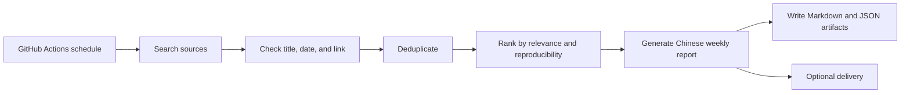

# Research Agent Toolkit

[](https://github.com/linshuijin6/research-agent-toolkit/actions/workflows/tests.yml)
[](https://github.com/linshuijin6/research-agent-toolkit/actions/workflows/literature-monitor.yml)
[](LICENSE)

**Research Agent Toolkit** is a small Python toolkit for scheduled literature and model-update monitoring with GitHub Actions.

The first preset comes from a PET/MRI research workflow: weekly monitoring for MRI-to-PET, Tau PET, Alzheimer's disease, medical vision-language models, medical CLIP-style models, GitHub releases, and Hugging Face model cards.

The v1.0 scope is deliberately narrow: make one weekly monitoring workflow reproducible before adding broader presets or dashboard features.

简体中文说明见 [README.zh-CN.md](README.zh-CN.md).

---

## Current scope

| Capability | v1.0 status |
|---|---:|
| Scheduled literature monitoring | Supported |
| NeuroPET / MRI-to-PET / Tau PET / AD preset | Supported |
| Medical VLM / medical CLIP / foundation-model preset | Supported |
| GitHub Actions automation | Supported |
| Chinese weekly report | Supported |
| Model-assisted report writing | Supported |
| Optional report delivery | Supported, off by default |
| Notion workflow | Planned, not in v1.0 |

See the [v1.0 completeness audit](docs/completeness-audit.zh-CN.md), [architecture note](docs/architecture.md), and [release checklist](docs/release-checklist.md).

---

## Background

This repository started from a practical research need: checking new PET/MRI papers, medical imaging model releases, and related code updates every week, then writing an auditable report from the retrieved metadata.

The toolkit is most useful for:

- biomedical engineering students;
- medical imaging researchers;
- PET (Positron Emission Tomography) / MRI (Magnetic Resonance Imaging) researchers;
- AI-for-science users who want scheduled literature digests;
- maintainers who prefer inspectable automation over opaque end-to-end agents.

---

## Maintainer needs

The main maintenance work is ordinary research software work:

- add tests for source connectors, ranking, verification, and delivery modules;
- review GitHub Actions workflows for reliability and reproducibility;
- improve configuration validation so new users can diagnose setup errors;
- keep examples and documentation aligned with the code;
- add research-topic presets beyond biomedical imaging;
- prepare releases with notes and known limitations;
- audit report outputs so factual fields are supported by retrieved metadata.

---

## Related research repositories

The toolkit is used alongside public PET/MRI and MRI-to-PET research repositories, including:

- [`replicaLT`](https://github.com/linshuijin6/replicaLT): plasma-guided 3D MRI-to-PET generation;
- [`MRI2PET`](https://github.com/linshuijin6/MRI2PET): MRI-to-PET research experiments;
- [`ADNI_dataprocess`](https://github.com/linshuijin6/ADNI_dataprocess): data processing utilities for ADNI-style neuroimaging workflows.

These repositories provide downstream scenarios for weekly literature monitoring, model-update tracking, experiment reporting, documentation maintenance, and reproducible biomedical AI research workflows.

---

## Workflow overview



Default search flow:

1. Search the latest 7 days.
2. If strong results are insufficient, extend to 30 days.
3. Check metadata before inclusion.
4. Keep at most 5 strong results per module and 3 indirect results.
5. Produce Markdown and JSON artifacts for every run.

For implementation details, see [docs/architecture.md](docs/architecture.md).

---

## What it monitors

### Module A: NeuroPET / MRI-to-PET / Tau PET / AD

Default topics include MRI-to-PET synthesis, pseudo-PET generation, Tau PET, amyloid PET, FDG PET, PET reconstruction, multimodal neuroimaging, and deep learning methods involving PET and MRI.

### Module B: Medical VLM / medical CLIP / foundation-model updates

Default topics include medical vision-language models, biomedical CLIP-style models, radiology foundation models, GitHub repositories and releases, and Hugging Face model or dataset cards.

---

## Example output

The generated Chinese weekly report uses six sections:

1. 本周期最重要结论
2. MRI-to-PET / Tau PET / Alzheimer's disease 强相关论文
3. 医学图像大模型 / 医学视觉语言模型更新
4. 间接相关但可能有启发的论文或模型
5. 未纳入内容与原因
6. 下周建议关注关键词

A sanitized demo report is available at [docs/demo-email.zh-CN.md](docs/demo-email.zh-CN.md).

---

## Quick start

```bash
git clone https://github.com/linshuijin6/research-agent-toolkit.git
cd research-agent-toolkit
python -m pip install --upgrade pip
pip install -e ".[dev]"
cp config.example.yaml config.yaml
rat validate-config --config config.yaml
rat literature-monitor --config config.yaml --dry-run
```

Generated files are written to `outputs/YYYY-MM-DD/`.

Typical outputs are `email_zh.md`, `report.json`, `candidates.json`, and `excluded.json`.

For a more detailed Chinese setup guide, see [docs/quickstart.zh-CN.md](docs/quickstart.zh-CN.md).

---

## Configuration

Copy `config.example.yaml` to `config.yaml`, then adjust topics, source settings, model endpoint settings, and optional delivery settings for your environment.

By default, the workflow runs in dry-run mode and only writes local artifacts.

---

## GitHub Actions

The default workflow runs every Monday at 00:00 UTC, which is 08:00 Beijing time.

```yaml
on:
  schedule:
    - cron: "0 0 * * 1"
  workflow_dispatch:
```

The workflow uploads artifacts and does not send reports unless delivery is explicitly enabled.

---

## Ranking formula

Each candidate receives a 0-100 priority score:

\[
S = 20\left(0.40R + 0.20N + 0.15C + 0.10P + 0.10Q + 0.05T\right)
\]

LaTeX source:

```latex
S = 20\left(0.40R + 0.20N + 0.15C + 0.10P + 0.10Q + 0.05T\right)
```

Where `R` is relevance, `N` is novelty, `C` is clinical or research value, `P` is reproducibility, `Q` is source quality, and `T` is timeliness.

---

## Safety and data handling

- Dry-run is enabled by default.
- Source verification is required by default.
- v1.0 does not read or write Notion.
- The workflow only uses retrieved candidate metadata for report generation.
- Factual fields such as paper titles, DOI values, code links, licenses, model weights, and datasets should be supported by retrieved metadata.

---

## Roadmap

- v1.1: draft review mode improvements.
- v1.2: MCP (Model Context Protocol) adapter.
- v1.3: Notion daily summary workflow.
- v1.4: Web dashboard.
- v1.5: More research-topic presets beyond biomedical imaging.

See the [public roadmap](docs/roadmap.md) for release-readiness tasks and planned extension work.

---

## Citation

If this project helps your research workflow, please cite the repository using [CITATION.cff](CITATION.cff).

## License

Apache License 2.0. See [LICENSE](LICENSE).
