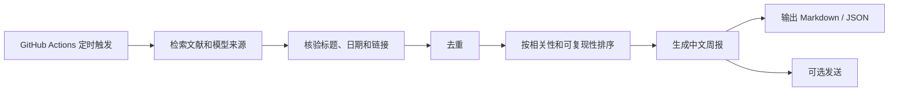

# Research Agent Toolkit

[](https://github.com/linshuijin6/research-agent-toolkit/actions/workflows/tests.yml)
[](https://github.com/linshuijin6/research-agent-toolkit/actions/workflows/literature-monitor.yml)
[](LICENSE)

**Research Agent Toolkit** 是一个小型 Python 工具箱，用 GitHub Actions 定时运行科研文献和模型更新监控。

v1.0 的第一个 preset 来自 PET/MRI 研究场景：每周监控 MRI-to-PET、Tau PET、AD、医学图像大模型、医学 VLM、医学 CLIP、GitHub 项目更新和 Hugging Face 模型卡。

本项目当前刻意保持小范围：先把一个可重复运行的周报流程做好，而不是做成泛化的自治 Agent 框架。

English README: [README.md](README.md)

---

## 当前范围

| 能力 | v1.0 状态 |
|---|---:|
| 定时文献监控 | 已支持 |
| NeuroPET / MRI-to-PET / Tau PET / AD 预设 | 已支持 |
| 医学 VLM / 医学 CLIP / foundation model 预设 | 已支持 |
| GitHub Actions 自动运行 | 已支持 |
| 中文周报 | 已支持 |
| LLM-compatible 报告生成 | 已支持 |
| 可选报告发送 | 已支持，默认关闭 |
| Notion workflow | 计划中，v1.0 不包含 |

完整边界见：[v1.0 完整性审计](docs/completeness-audit.zh-CN.md)。

---

## 项目背景

这个仓库来自一个实际科研需求：每周检查 PET/MRI 方向的新论文、医学影像模型发布和相关代码更新，并把结果整理成可回溯的报告。

适合用户包括：

- 生物医学工程研究生；
- 医学影像 AI 研究者；
- PET (Positron Emission Tomography，正电子发射断层成像) / MRI (Magnetic Resonance Imaging，磁共振成像) 方向研究者；
- 关注 MRI-to-PET、Tau PET、AD (Alzheimer's disease，阿尔茨海默病) 的用户；
- 想要低成本、可审计文献监控流程的科研人员。

---

## 工作流概览



默认流程：

1. 先检索最近 7 天。
2. 强相关结果不足时扩展到最近 30 天。
3. 纳入正文前进行标题、日期和链接核验。
4. 每个模块最多保留 5 条强相关结果。
5. 每次运行输出 Markdown 和 JSON 文件。

架构说明见：[docs/architecture.md](docs/architecture.md)。

---

## 监控内容

### 模块 A：NeuroPET / MRI-to-PET / Tau PET / AD

默认关注：

- MRI-to-PET 合成；
- pseudo-PET 生成；
- Tau PET 预测、分析和定量；
- amyloid PET、FDG PET 与 AD；
- PET 重建；
- 多模态神经影像；
- PET 与 MRI 结合的深度学习方法。

### 模块 B：医学图像大模型 / 医学 VLM / 医学 CLIP

默认关注：

- medical vision-language model；
- biomedical VLM；
- medical CLIP；
- radiology foundation model；
- GitHub 仓库、release 和 README；
- Hugging Face 模型页、数据集页、model card 和 dataset card。

---

## 示例输出

每次运行生成的中文周报固定包含六部分：

1. 本周期最重要结论
2. MRI-to-PET / Tau PET / Alzheimer's disease 强相关论文
3. 医学图像大模型 / 医学视觉语言模型更新
4. 间接相关但可能有启发的论文或模型
5. 未纳入内容与原因
6. 下周建议关注关键词

脱敏示例见：[docs/demo-email.zh-CN.md](docs/demo-email.zh-CN.md)。

---

## 快速开始

```bash
git clone https://github.com/linshuijin6/research-agent-toolkit.git
cd research-agent-toolkit
python -m pip install --upgrade pip
pip install -e ".[dev]"
cp config.example.yaml config.yaml
rat validate-config --config config.yaml
rat literature-monitor --config config.yaml --dry-run
```

输出目录：

```text
outputs/YYYY-MM-DD/
```

常见输出：

```text
email_zh.md
report.json
candidates.json
excluded.json
```

更详细教程见：[docs/quickstart.zh-CN.md](docs/quickstart.zh-CN.md)。

---

## 配置说明

复制 `config.example.yaml` 为 `config.yaml`，然后按自己的环境修改主题、来源、模型接口和可选发送设置。

默认只执行 dry-run 并写出本地 artifacts，不会主动发送报告。

---

## GitHub Actions 定时运行

v1.0 默认每周一 UTC 00:00 运行，对应北京时间每周一 08:00：

```yaml
on:
  schedule:
    - cron: "0 0 * * 1"
  workflow_dispatch:
```

你也可以在 GitHub Actions 页面手动触发。

---

## 评分公式

每条候选内容会得到 0-100 分：

\[
S = 20\left(0.40R + 0.20N + 0.15C + 0.10P + 0.10Q + 0.05T\right)
\]

LaTeX 代码：

```latex
S = 20\left(0.40R + 0.20N + 0.15C + 0.10P + 0.10Q + 0.05T\right)
```

其中：

- `R`：相关性；
- `N`：新颖性；
- `C`：临床或研究价值；
- `P`：可复现性；
- `Q`：来源质量；
- `T`：时效性。

---

## 安全与数据处理

- 默认 dry-run。
- 默认要求标题和链接核验。
- v1.0 不访问、不写入 Notion。
- 报告生成只使用已检索到的候选元数据。
- 论文标题、DOI、代码链接、权重、许可证和训练数据等事实字段应能回溯到候选元数据。

---

## Roadmap

后续计划：

- v1.1：增强草稿审阅模式。
- v1.2：加入 MCP (Model Context Protocol，模型上下文协议) 适配层。
- v1.3：加入 Notion daily summary 工作流。
- v1.4：加入 Web dashboard。
- v1.5：加入更多科研方向 preset。

更详细计划见：[docs/roadmap.md](docs/roadmap.md)。

---

## 引用

如果本项目对你的研究工作流有帮助，请使用 [CITATION.cff](CITATION.cff) 中的信息引用本仓库。

## 许可证

Apache License 2.0，详见 [LICENSE](LICENSE)。
