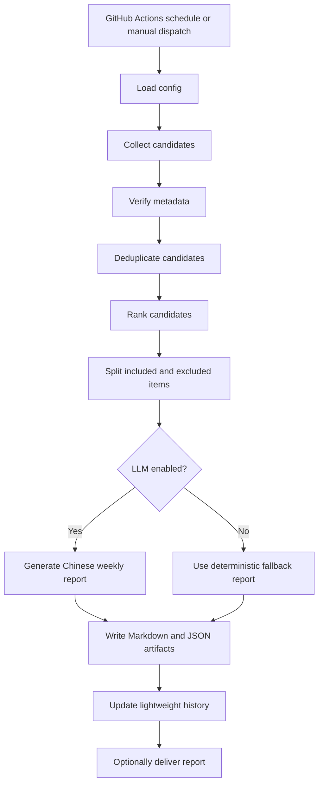

# Research Agent Toolkit Architecture

This document describes the v1.0 architecture of Research Agent Toolkit.

The project keeps research-agent workflows reproducible, inspectable, and easy to fork for students, labs, and open-source maintainers.

## System goals

- Run scheduled workflows on GitHub Actions.
- Search multiple scholarly and developer sources.
- Verify metadata before including an item in a report.
- Deduplicate candidates across sources.
- Rank candidates with transparent scoring.
- Generate Markdown and JSON artifacts for every run.
- Use an OpenAI-compatible Large Language Model (LLM) backend when configured.
- Keep dry-run and auditable behavior as the default.

## High-level workflow

## Main runtime entrypoints

| Layer | File | Responsibility |
|---|---|---|
| CLI | `src/research_agent_toolkit/cli.py` | Provides `rat validate-config`, `rat literature-monitor`, and `rat send-test-email`. |
| Workflow | `src/research_agent_toolkit/workflows/literature_monitor.py` | Orchestrates search, verification, deduplication, ranking, report generation, artifact writing, history update, and optional delivery. |
| Sources | `src/research_agent_toolkit/sources/` | Implements source adapters for PubMed, arXiv, Crossref, Europe PMC, Semantic Scholar, GitHub, Hugging Face, and web search. |
| Processing | `src/research_agent_toolkit/processing/` | Deduplicates, filters, and ranks candidate items. |
| Verification | `src/research_agent_toolkit/verification/` | Checks date recency, URL accessibility, and title consistency. |
| LLM | `src/research_agent_toolkit/llm/` | Provides OpenAI-compatible report generation with deterministic fallback behavior. |
| Delivery | `src/research_agent_toolkit/delivery/` | Writes Markdown/JSON artifacts and supports optional report delivery. |
| State | `src/research_agent_toolkit/state/` | Stores lightweight history for repeated monitoring runs. |

## Candidate lifecycle

1. **Collection**: enabled topics are read from configuration and source adapters return normalized candidate items.
2. **Verification**: metadata is checked for source reliability, date recency, link availability, and title consistency.
3. **Deduplication**: similar candidates from multiple sources are merged.
4. **Ranking**: each candidate receives a 0-100 priority score based on relevance, novelty, research value, reproducibility, source quality, and timeliness.
5. **Inclusion / exclusion**: strong candidates are included in the report, while excluded candidates are kept with reasons for auditing.
6. **Report generation**: verified JSON input is converted into a Chinese weekly report through the configured LLM backend or a deterministic fallback template.
7. **Artifacts**: every run writes `email_zh.md`, `report.json`, `candidates.json`, and `excluded.json` under `outputs/YYYY-MM-DD/`.

## GitHub Actions design

The repository includes two main workflows:

- `.github/workflows/tests.yml`: runs pytest on push, pull request, and manual dispatch.
- `.github/workflows/literature-monitor.yml`: runs the monitor weekly and uploads report artifacts.

The monitor workflow runs in dry-run mode by default.

## Safety model

Research Agent Toolkit is designed to avoid misleading automation:

- Dry-run is the default execution mode.
- Source verification is part of the normal pipeline.
- LLM generation uses verified JSON input.
- The LLM is instructed not to invent paper titles, DOI values, code links, licenses, model weights, or datasets.
- Excluded candidates are recorded with reasons to support manual review.

## Extension points

The main extension points are:

- new source adapters under `src/research_agent_toolkit/sources/`;
- new research-topic presets in `config.example.yaml`;
- stricter verification policies under `src/research_agent_toolkit/verification/`;
- new report templates and prompts under `src/research_agent_toolkit/llm/`;
- additional delivery modes under `src/research_agent_toolkit/delivery/`;
- an MCP (Model Context Protocol) adapter for external research tools;
- a lightweight web dashboard for report review and configuration.

## Maintainer workflow

Maintainers should prioritize:

- keeping tests green;
- reviewing source connector behavior when upstream APIs change;
- hardening validation errors so users can fix configuration issues quickly;
- maintaining transparent release notes;
- keeping safety principles visible in both documentation and code;
- adding small, auditable modules rather than opaque end-to-end agent behavior.
